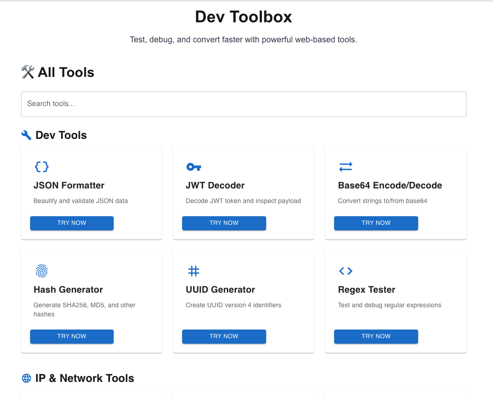

# 🛠️ Developer Toolkit

All-in-one toolkit for developers – test, debug, and convert with ease.

> Built with **Next.js**, **Tailwind CSS**, **Material UI**, and designed with **Atomic Design** principles.

---

## 🧰 Available Tools

- **JSON Formatter** – Beautify and validate JSON
- **JWT Decoder** – Decode token and inspect payload
- **Base64 Encode/Decode**
- **Hash Generator** – SHA256, MD5, etc.
- **UUID Generator**
- **Regex Tester**
- **IP Check**, **DNS Lookup**, **Ping**, **WHOIS**, **Geolocation**
- **SSL Checker**, **Header Viewer**, **Redirect Tracer**
- **Cron Parser**, **Time Converter**

> More tools coming soon...

---

## 🖼️ UI Preview



---

## 🧑‍💻 Tech Stack

- [Next.js](https://nextjs.org/)
- [Tailwind CSS](https://tailwindcss.com/)
- [Material UI](https://mui.com/)
- [TypeScript](https://www.typescriptlang.org/)
- [Atomic Design](https://bradfrost.com/blog/post/atomic-web-design/)

---

## 🧩 Development

Run the development server:

```bash
npm run dev
# or
yarn dev
# or
pnpm dev
# or
bun dev
```

Open [http://localhost:3000](http://localhost:3000) with your browser to see the result.
